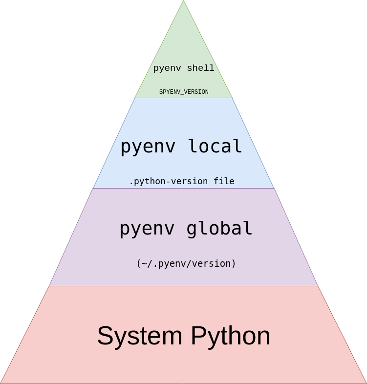

# pyenv
Managing multiple python versions with pyenv

## install

```bash
brew reinstall curl openssl readline sqlite3 xz zlib
curl https://pyenv.run | bash
```

## use pyenv to install

List of Python 3.x envs

```bash
pyenv install --list | grep " 3\.[678]"
```

Install exact version (3.8.18) and use it locally (in path/to/python/module folder)

```bash
mkdir -p path/to/python/module
cd path/to/python/module
pyenv install 3.8.18
pyenv local 3.8.18
```



## rtfm
https://realpython.com/intro-to-pyenv/
