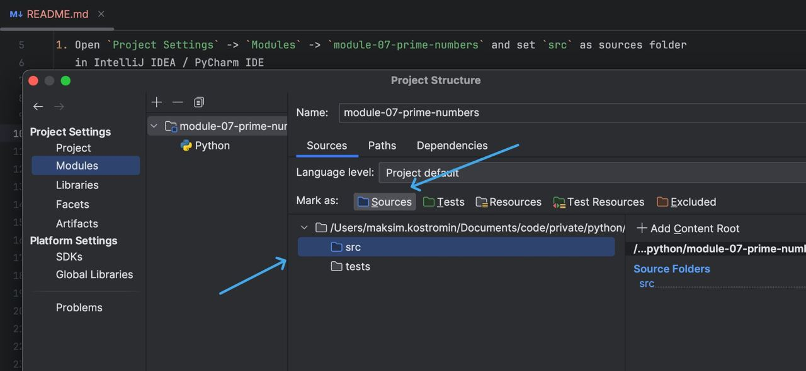
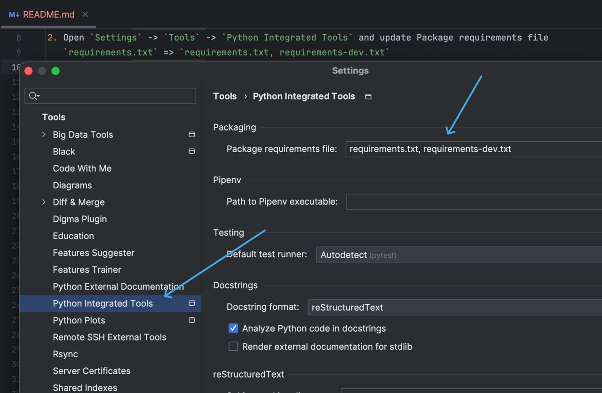

# prime numbers

## prerequisites

1. Open `Project Structure` -> `Modules` -> `module-07-prime-numbers` and set `src` as sources folder
   in IntelliJ IDEA / PyCharm IDE
   
2. Open `Settings` -> `Tools` -> `Python Integrated Tools` and update Package requirements file
   `requirements.txt` => `requirements.txt, requirements-dev.txt`
   

## development

```bash
cd ./module-07-prime-numbers
python -m venv .venv
source .venv/bin/activate
PYTHONPATH=.
pip install -r requirements.txt -r requirements-dev.txt
# which pylint pycodestyle
# => ${PWD}/.venv/bin/pylint
# => ${PWD}/.venv/bin/pycodestyle
PYTHONPATH=./src pylint ./src ./tests
PYTHONPATH=./src pycodestyle ./src ./tests
PYTHONPATH=./src pytest ./tests
# ...
deactivate
```

## production

```bash
cd ./module-07-prime-numbers
python -m venv .venv
source .venv/bin/activate
pip install -r requirements.txt
python ./src
```
